# Top 30 Best Web Scraping and Proxy Tools in 2025

Ever tried to gather data from websites at scale, only to hit a wall of blocks and CAPTCHAs? You're definitely not alone. Whether you need to monitor competitor prices, collect market research, or verify ads across different regions, the right proxy network and scraping infrastructure can make the difference between a project that barely crawls and one that flies. These tools are built to handle the tough stuff—rotating IPs, bypassing geo-restrictions, and keeping your data pipeline running smoothly without constant babysitting.

## **[Bright Data](https://brightdata.com)**

The heavyweight champion of proxy networks, perfect for businesses that need enterprise-grade reliability and won't settle for mediocre uptime.

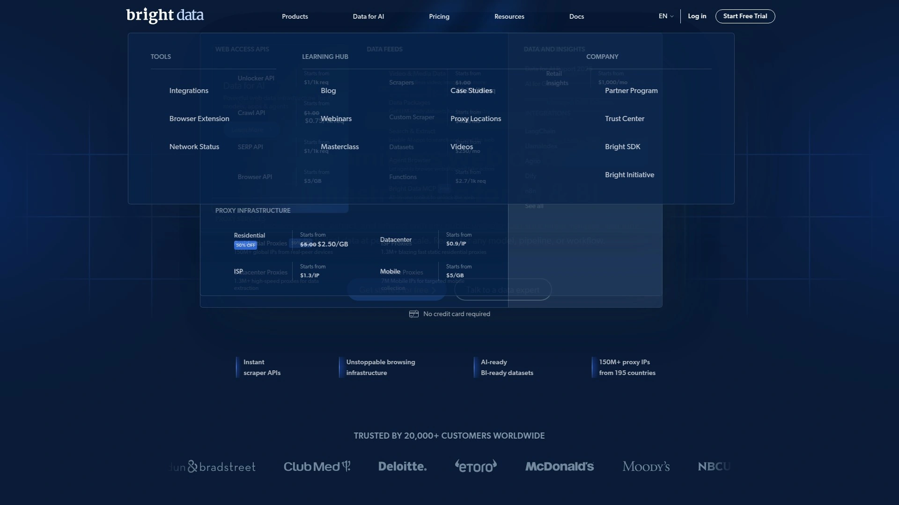

Bright Data operates one of the largest proxy networks on the planet, with over 150 million residential IPs spread across 195 countries. Their infrastructure includes datacenter, ISP, mobile, and residential proxies, giving you flexibility for virtually any use case. The platform shines with precise geo-targeting down to city and ZIP code levels, which is crucial when you need hyper-localized data. Their Scraping Browser product handles JavaScript rendering and automatic retry logic, while the Web Unblocker tackles even the trickiest anti-bot systems. The dashboard might feel overwhelming at first, but once you get the hang of it, you'll appreciate the granular control over rotation settings, session management, and targeting parameters. Pricing starts around $4 per GB for residential proxies with pay-as-you-go flexibility, though costs can add up quickly at scale. Best suited for mid-to-large enterprises with dedicated scraping teams who need rock-solid performance and can navigate the technical complexity.

## **[Oxylabs](https://oxylabs.io)**

Premium proxy provider recognized by industry reviewers multiple years running, ideal for businesses prioritizing compliance and ethical sourcing.

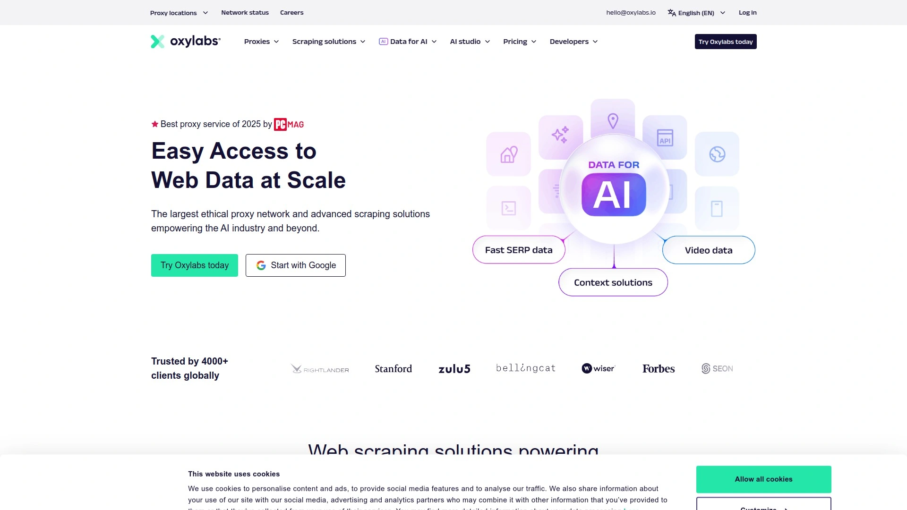

Oxylabs boasts a massive 175+ million IP pool with coverage in 195 countries and consistently delivers success rates above 99%. Their next-gen residential proxies use AI to mimic real user behavior, making them exceptionally effective at avoiding detection. The platform offers rotating and static options with support for HTTP, HTTPS, and SOCKS5 protocols. City-level targeting, ASN filtering, and unlimited concurrent connections come standard. Their Web Unblocker and SERP scraper APIs simplify complex scraping tasks. You'll get 24/7 support plus a dedicated account manager on higher-tier plans. Residential proxies start at $8 per GB with pay-as-you-go, while datacenter proxies begin around $12 monthly. The premium pricing reflects their focus on enterprise clients, but the reliability and ethical procurement practices justify the investment for companies that need GDPR and CCPA compliance baked in.

## **[Smartproxy](https://smartproxy.com)**

Recently rebranded as Decodo, this provider delivers excellent value with fast IP rotation and straightforward pricing that won't confuse your finance team.

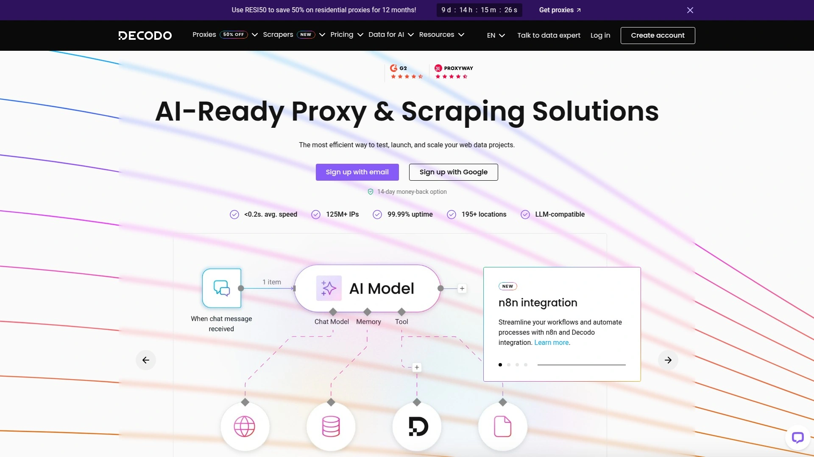

Smartproxy offers over 40 million residential proxies with global coverage and city-level targeting across most major markets. Their dashboard is genuinely user-friendly, making setup quick even for teams without dedicated proxy engineers. Unlimited concurrent sessions, 10-minute sticky sessions, and HTTP/SOCKS5 support cover most scraping scenarios. The X Browser product provides a Chrome-based solution for JavaScript-heavy sites. Residential proxies start impressively low at around $0.50 per GB with volume discounts, making them one of the most affordable premium options. While they lack some of the advanced targeting features found in pricier alternatives, the combination of solid performance, ease of use, and cost-effectiveness makes them a smart choice for small to medium businesses scaling their data collection efforts.

## **[SOAX](https://soax.com)**

Flexible proxy network with precise filtering options and stable IPs, plus you get access to all proxy types with a single subscription.

SOAX claims 155 million residential proxies though the actual daily pool is smaller. What sets them apart is flexible rotation control, city plus ASN targeting on all plans, and UDP protocol support through SOCKS5—rare in this space. Their "look-a-like rotation" feature and browser optimization settings give extra control over traffic patterns. The infrastructure performs well and responds quickly, especially in US locations. All proxy types (residential, mobile, ISP, datacenter) are included in your plan, which simplifies things if you need to switch between different types. Residential proxies start at $4 per GB with a 3-day trial available. The lower-tier plans limit concurrent requests, so factor that in if you're running high-volume operations. Best for teams that value targeting flexibility and want access to multiple proxy types without juggling separate subscriptions.

## **[NetNut](https://netnut.io)**

ISP-direct proxy provider offering residential IPs straight from internet service providers for enhanced stability and speed.

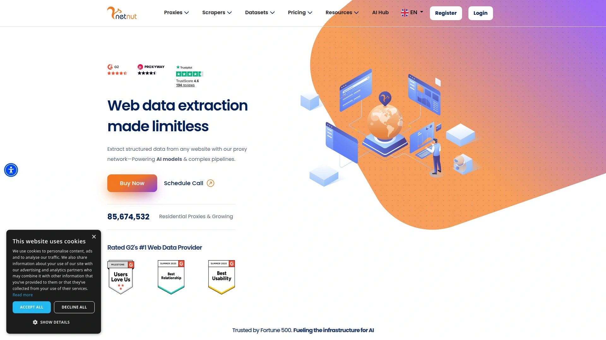

NetNut's residential proxies come directly from ISPs rather than peer-to-peer networks, resulting in faster speeds and more stable connections. They offer static residential proxies that maintain the same IP for extended periods, perfect for account-based tasks. Geographic targeting covers major regions with country, state, and city options. The cheaper plans are lean on features, but paying more unlocks advanced functionality like ASN targeting and longer sessions. Residential pricing starts around $9 per GB on pay-as-you-go plans. Their ISP proxies begin at roughly $21 monthly for 10 proxies. The entry costs are higher than budget providers, but you're paying for the direct-from-ISP reliability that matters when you need consistent performance across long-running scraping jobs.

## **[Webshare](https://webshare.io)**

Absolute self-service platform with customizable subscriptions and solid infrastructure, though it skips some standard features.

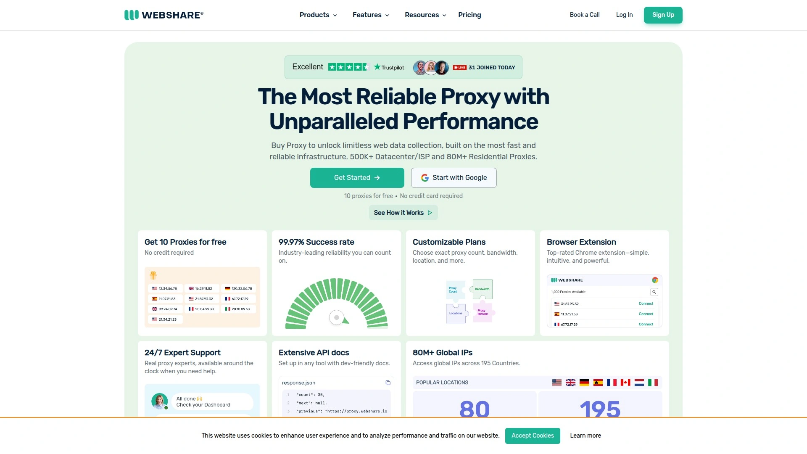

Webshare advertises 80 million residential proxies with coverage in 195 countries. The infrastructure proved rock-solid during testing, and pricing compares favorably with mid-market providers at $1.75 per GB starting rate. Their main weakness is limited functionality—currently only country-level targeting and basic rotation settings. No city targeting or advanced session controls yet. Performance is slower than market leaders but perfectly adequate for most use cases. What they do well is simplicity and reliability. The dashboard is straightforward, setup takes minutes, and the proxy pool delivers consistent results. Their datacenter and ISP proxies are actually their stronger products. Good choice if you need reliable residential proxies for general scraping tasks and don't require advanced geo-targeting features.

## **[IPRoyal](https://iproyal.com)**

UAE-based provider with competitive pricing, unlimited bandwidth on datacenter proxies, and one of the highest user satisfaction ratings around.

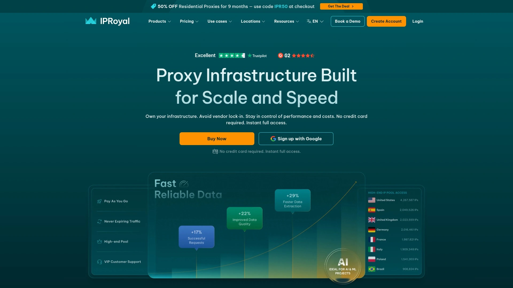

IPRoyal maintains over 34 million IPs across residential, datacenter, ISP, and mobile proxy types. Their datacenter proxies are the standout offering—99.9% uptime, unlimited bandwidth, and support for HTTP(S) and SOCKS5 protocols. Residential proxies start at just $2.45 per GB, among the lowest in the premium segment. Geographic coverage spans virtually every country with state and city-level targeting available. Chrome and Firefox extensions simplify proxy switching for browser-based tasks. The proxy pool is relatively small compared to industry giants, and there's no free trial. Support is 24/7 but doesn't include phone assistance. Despite these limitations, the combination of affordable pricing, unlimited datacenter bandwidth, and strong user reviews (4.6/5 from thousands of reviews) makes them excellent for budget-conscious teams.

## **[Rayobyte](https://rayobyte.com)**

Well-known for datacenter proxies, also offering residential addresses with non-expiring packages that scale competitively.

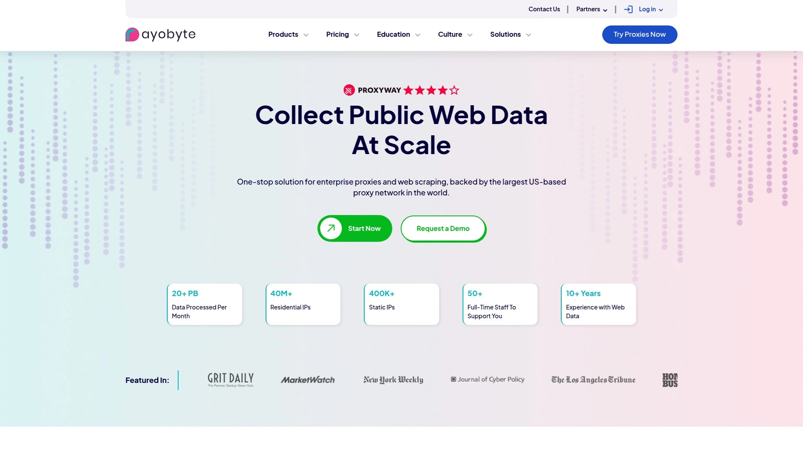

Rayobyte's residential proxies surprised testers with a large pool size despite less aggressive marketing than competitors. Their non-expiring traffic packages are unique—buy bandwidth and use it whenever you need it without monthly deadlines. Geographic targeting includes country, state, and city filtering across 150+ locations. Residential proxies start at $3.50 per GB with a 2-day free trial offering 50 MB. The main drawback is speed—proxies tested up to three times slower than top performers. They also lack IP whitelisting and SOCKS5 support on residential plans. The dashboard could use improvement. However, if your use case isn't time-sensitive and you value the flexibility of non-expiring bandwidth, Rayobyte offers solid value, especially for their excellent datacenter proxy offerings.

## **[ScraperAPI](https://scraperapi.com)**

Purpose-built web scraping API that handles proxies, JavaScript rendering, and CAPTCHA solving in one simple endpoint.

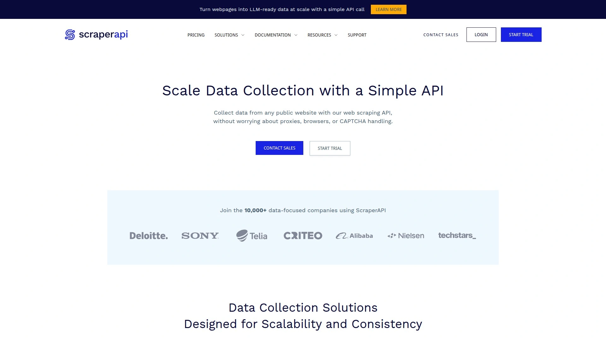

ScraperAPI abstracts away the complexity of proxy management by wrapping everything into a clean REST API. Just send your target URL, and their infrastructure handles proxy rotation, headless browsers, and CAPTCHA challenges automatically. They maintain over 200 million proxies across 150+ countries with geo-targeting support. Success rates push 99.99% thanks to smart retry logic and automatic IP rotation. The API supports multiple output formats including JSON, CSV, HTML, text, and Markdown. Webhook integration enables real-time data delivery. Structured data endpoints extract specific information from popular sites without parsing HTML. Plans start at $39 monthly for 100,000 requests, scaling up to 3 million requests for $299 on the Business plan. Perfect for developers who want to focus on data analysis rather than infrastructure management.

## **[Apify](https://apify.com)**

Full-stack cloud platform for web scraping and browser automation, offering both pre-built scrapers and custom development tools.

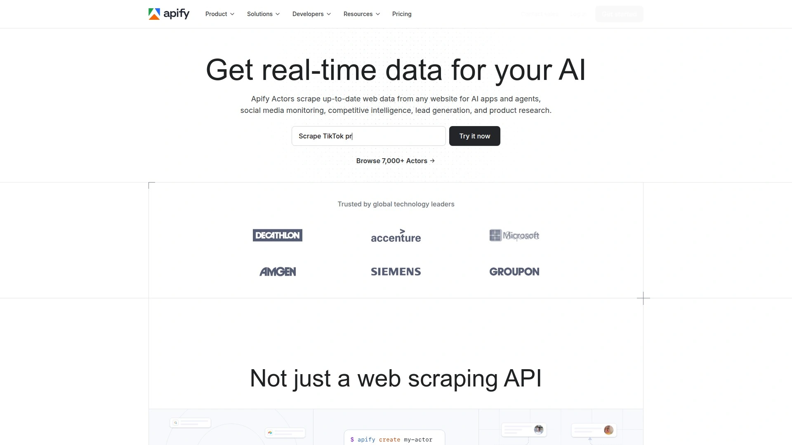

Apify is more than a proxy provider—it's a complete automation platform with cloud hosting, serverless computing, and a marketplace of ready-made scrapers called Actors. You can use pre-built scrapers for popular sites or build custom ones using JavaScript. The platform handles proxy rotation, JavaScript rendering, scheduling, and data storage. Smart proxy features minimize costs while maintaining high success rates. Integration options include webhooks, APIs, and direct connections to data warehouses. The free plan includes $5 monthly credit with no time limit, making it accessible for experimentation. Paid plans start at $39 monthly. The learning curve is steeper than pure proxy services, but the comprehensive toolset rewards the investment. Ideal for developers who need both scraping infrastructure and workflow automation in one platform.

## **[ScrapingBee](https://scrapingbee.com)**

User-friendly scraping API that manages headless browsers and proxy rotation, with AI-powered data extraction capabilities.

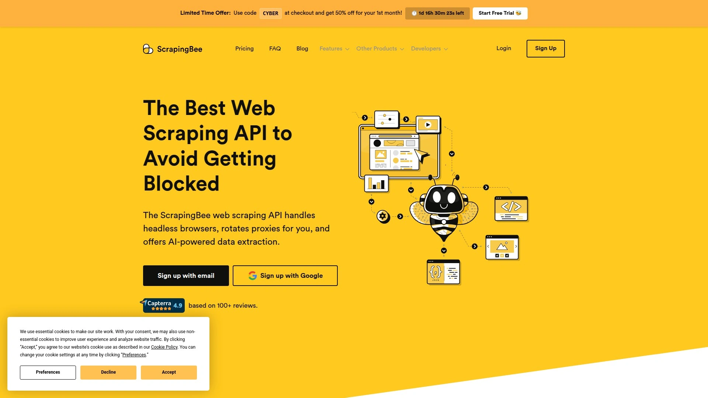

ScrapingBee simplifies data extraction by handling all the messy infrastructure behind a straightforward API. Send requests with your target URL, and their service manages browser rendering, proxy rotation, and CAPTCHA solving. Supports JavaScript-heavy sites through headless Chrome instances. The API works with multiple programming languages including Python, Node.js, Ruby, and Java. Custom headers, cookies, and POST requests are all supported. Recent additions include AI-powered data extraction that can identify and extract structured information without CSS selectors. Geographic targeting lets you scrape from specific countries. Plans start around $49 monthly for 150,000 API credits. Good for teams that want reliable scraping without managing proxy pools or browser automation code.

## **[Zyte](https://zyte.com)**

Enterprise-grade scraping platform with AI-powered extraction and managed services for companies needing fully supported solutions.

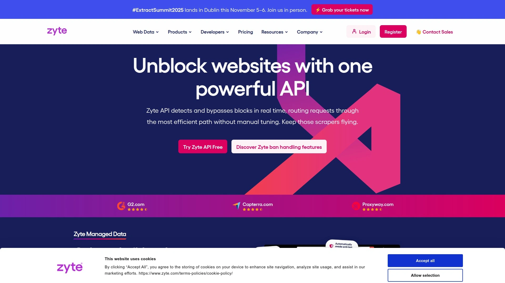

Previously known as Scrapinghub, Zyte offers both self-service tools and fully managed data extraction services. Their Smart Proxy Manager uses AI to automatically route requests through the best proxy type for each target. Automatic throttling and ban detection keep your scrapers running smoothly. The platform includes built-in scrapers for major sites, custom scraper development tools, and cloud hosting infrastructure. For enterprises without technical teams, Zyte provides end-to-end managed services where their experts handle everything from scraper development to ongoing maintenance. Pricing reflects the premium positioning with custom quotes for most services. Best for larger organizations that need either sophisticated self-service tools or fully managed data collection programs with dedicated support.

## **[Nimbleway](https://nimbleway.com)**

Premium residential proxy service with city-level targeting and stable performance across 150 locations worldwide.

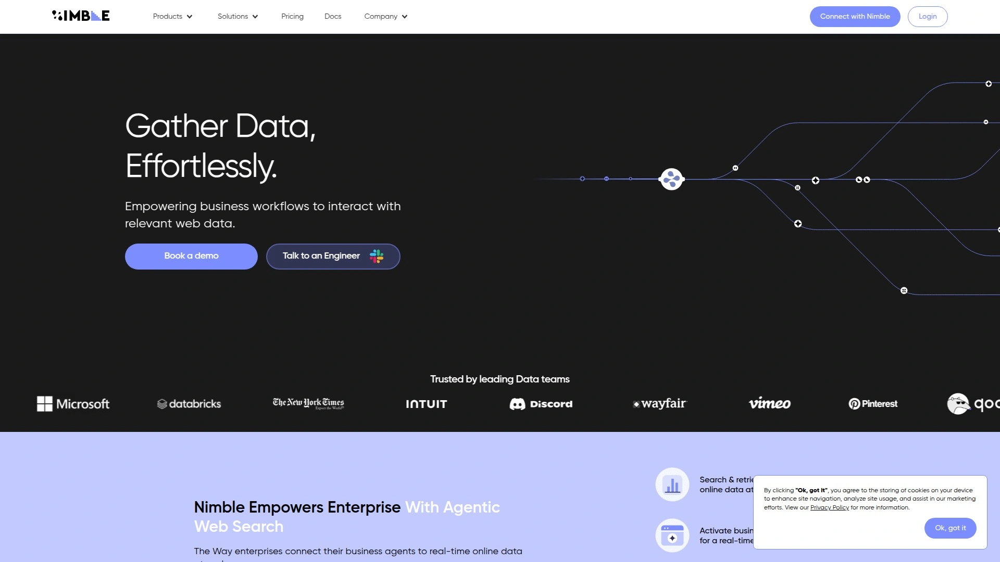

Nimbleway focuses on quality over quantity with residential proxies optimized for reliability rather than pool size bragging rights. Their IPs come from ethically sourced residential devices with precise targeting options including country, state, and city filtering. Automatic IP rotation and sticky sessions up to 30 minutes accommodate different scraping patterns. The infrastructure maintains consistent performance under load with success rates competing against top providers. Support includes documentation and direct assistance for troubleshooting. The premium pricing reflects their focus on business customers who need dependable service. While they don't advertise specific pool sizes or offer free trials, the consistent performance makes them worth considering for businesses with established budgets prioritizing stability over cost optimization.

## **[DataImpulse](https://dataimpulse.com)**

Affordable residential proxy network with non-expiring traffic and a 7-day refund policy regardless of usage.

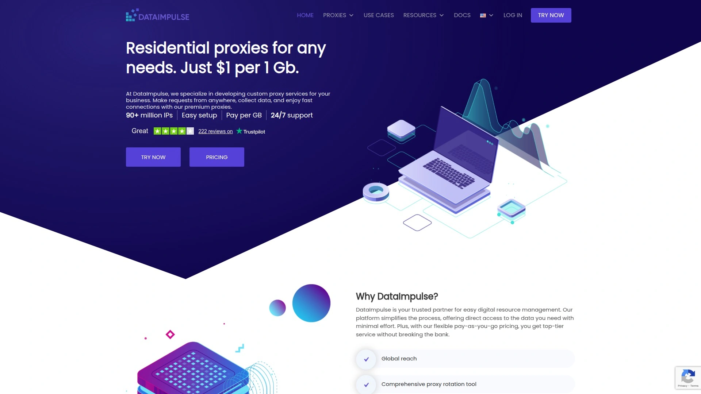

DataImpulse provides residential proxies across 150+ countries with flexible geo-targeting down to city or ASN level. Sticky sessions extend up to 30 minutes for account-based tasks. All purchased traffic is non-expiring, similar to Rayobyte's model—buy bandwidth and use it at your own pace. The 7-day refund policy applies even if you've used the service, showing confidence in their product. Pricing lands in the affordable range without sacrificing performance. While they handle big loads reasonably well during testing, extremely high-volume operations might strain their infrastructure compared to larger providers. Good middle-ground option for growing teams that need flexible pricing and don't want to commit to massive monthly subscriptions before validating their data collection projects.

## **[Infatica](https://infatica.io)**

Cost-effective residential proxies with no connection limits, performing well under heavy scraping loads despite modest pool size.

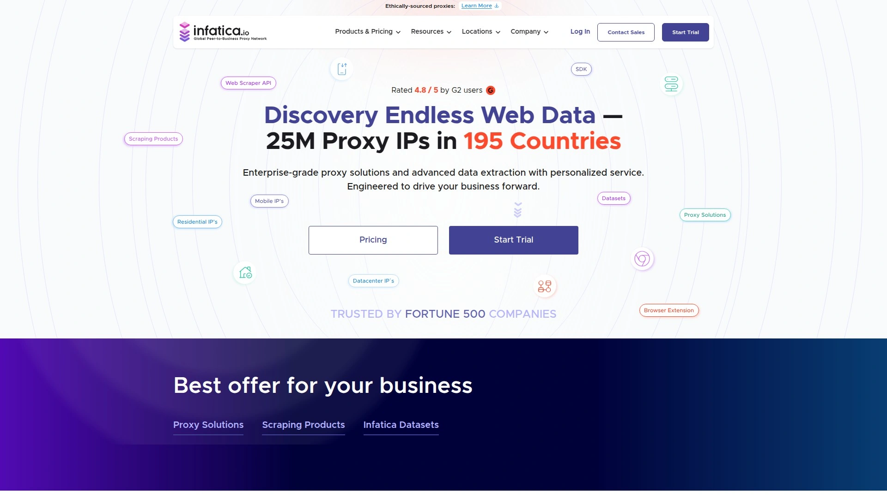

Infatica offers residential proxies from 150+ locations with country, city, and ASN targeting options. Their infrastructure handles large concurrent loads without throttling since there are no connection limits. Both pay-as-you-go and subscription models are available, with residential proxies priced competitively in the lower segment of premium providers. Proxies can rotate with each request or maintain sticky sessions from 5 to 60 minutes. They also provide datacenter proxies with US targeting and dedicated ISP proxies across 15+ countries. Mobile proxies round out the portfolio. Testing showed average performance for web scraping tasks, but the ability to handle big loads without artificial restrictions is valuable. Best for high-volume operations on a budget.

## **[Geonode](https://geonode.com)**

Budget-friendly residential proxy service with millions of IPs, unlimited traffic, and predictable pricing without bandwidth charges.

Geonode runs millions of residential proxies behind the scenes without mixing in datacenter IPs, ensuring more authentic traffic patterns. Their pricing model stands out—they don't charge based on bandwidth like most competitors. Instead, you get unlimited transfer with your subscription. This makes costs predictable for high-volume scraping projects. They offer a $5 trial for 10 GB to test the service. The infrastructure delivers faster and more consistent results than budget providers thanks to their pure residential network. Geographic coverage spans major markets with standard targeting options. Setup is straightforward with username/password authentication. While they lack some advanced features found in enterprise platforms, the unlimited bandwidth model and straightforward pricing make them appealing for cost-conscious teams with heavy data needs.

## **[Proxyrack](https://proxyrack.com)**

Only proxy provider supporting all protocols including HTTP, HTTPS, SOCKS4, SOCKS5, and UDP for maximum compatibility.

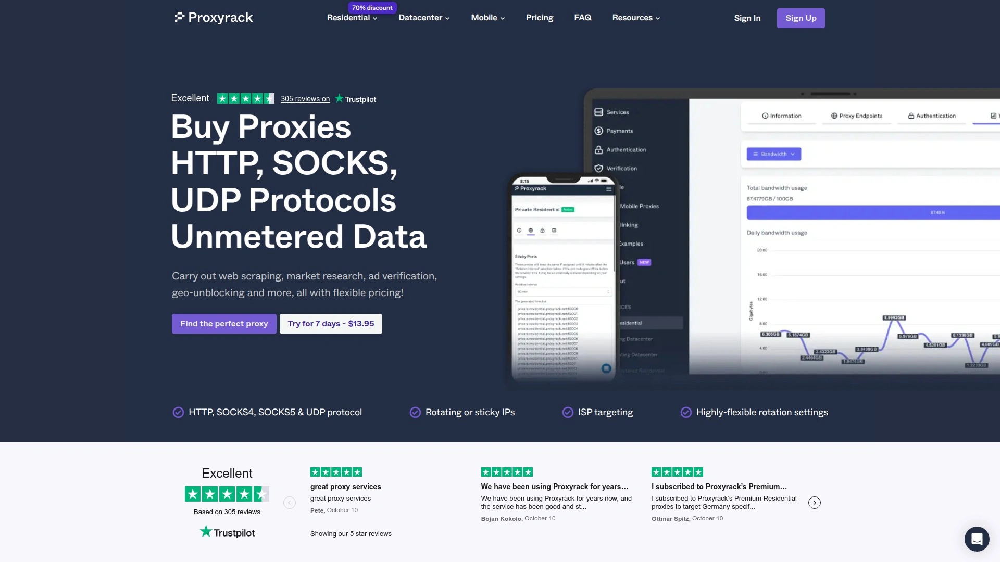

Proxyrack's standout feature is comprehensive protocol support, making them compatible with virtually any scraping tool or automation software. Their residential proxy network enables scraping with randomized IPs for each connection, or sticky ports with customizable rotation times for session-based tasks. The dashboard provides live reports so you can address issues immediately. They offer both trial and full plans with quick identity verification and no tedious onboarding. Residential proxies serve as an intermediary between you and the internet, routing requests through diverse IP addresses to maintain anonymity. The service emphasizes ease of integration and quick setup. Pricing is competitive within the mid-market segment. Good choice for teams using specialized software that requires specific protocol support beyond standard HTTP/HTTPS.

## **[Shifter](https://shifter.io)**

One of the first residential proxy providers founded in 2012, now serving over 25,000 clients including Fortune 500 companies.

Shifter provides rotating residential proxies with worldwide geo-targeting optimized for high success rates and low latency. Their network includes standard residential proxies, non-rotating options with 24/7 availability, and Tier 1 ISP proxies optimized for e-commerce. The platform also offers a Scraping API that combines their proxy network with anti-bot detection and CAPTCHA solving. Cloud hosting services run on proprietary data centers designed specifically for their infrastructure, achieving near-zero latency for blazing-fast performance. Connection options include HTTP/S and SOCKS4/5 protocols. Plans start from $9.99 monthly for basic services, scaling up to $99.98 for 5-port residential packages. The decade-plus track record and extensive client base including major corporations demonstrate their reliability and staying power in the competitive proxy market.

## **[ProxyScrape](https://proxyscrape.com)**

Belgium-based proxy provider emphasizing ethical sourcing with over 10 million rotating residential IPs and SSL encryption.

ProxyScrape operates an expansive pool of 10+ million back-connect rotating IP addresses from residential devices worldwide. The service helps users avoid restrictions and blocks while maintaining high-speed access. They emphasize ethical practices in sourcing proxies and include SSL encryption for enhanced data transfer security. Geographic targeting covers country, state, and city levels with unlimited concurrent connections on their plans. Success rates hit 99% with 0.8-second average response times. HTTP protocol support ensures compatibility with most scraping tools. While they don't offer advanced protocols like SOCKS5 found in some premium providers, their commitment to ethical sourcing and solid performance make them trustworthy. Pricing is competitive in the mid-range segment. Suitable for businesses that prioritize ethical data collection practices alongside reliable performance.

## **[Storm Proxies](https://stormproxies.com)**

Specialist in backconnect rotating proxies with access to 700,000+ shared rotating IPs, optimized for high-volume scraping.

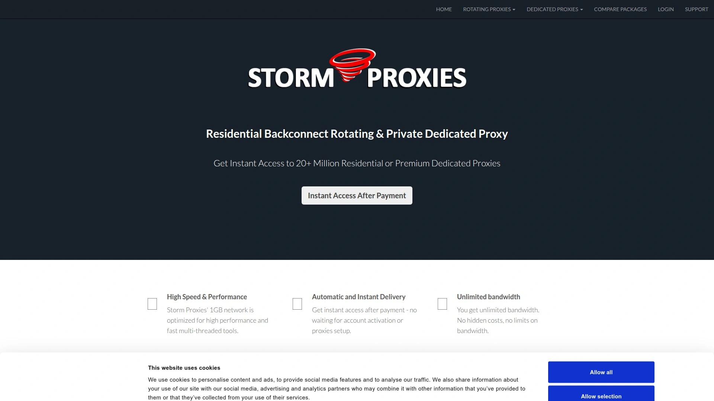

Storm Proxies focuses on rotating backconnect proxies that automatically change IP addresses with each connection request. Their network is optimized for high-volume data collection with unlimited bandwidth on most plans. They use proprietary technology to ensure proxies remain highly anonymous, keeping your real IP hidden. Plans are priced based on the number of ports rather than bandwidth, making them one of the cheapest options for unlimited scraping. Basic plans start around $39 monthly for 5 ports. Success rates hover around 95%, slightly lower than premium providers but acceptable for many use cases. Setup difficulty is moderate with standard configuration options. Best suited for high-volume scraping operations where you need unlimited bandwidth without worrying about per-GB costs eating into your budget.

## **[ParseHub](https://parsehub.com)**

Free no-code web scraping tool with visual interface, perfect for extracting data from complex websites without programming.

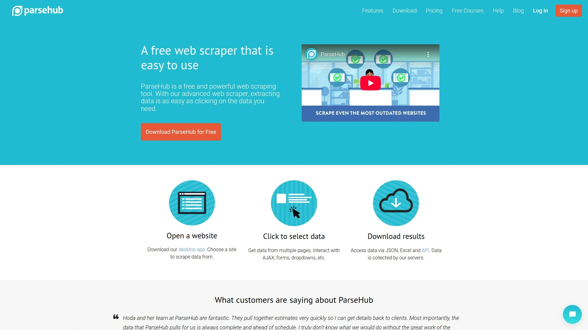

ParseHub lets you scrape websites by clicking on the data you want to extract—no coding required. The visual interface handles JavaScript-heavy sites, AJAX, and dynamic content automatically. You can extract data from maps, tables, infinite scrolling pages, and even handle forms and dropdowns. The free plan covers basic scraping tasks with cloud storage for your data. Paid plans unlock more advanced features like longer scraping sessions and higher priority processing. Data exports to JSON or CSV formats for easy integration with other tools. While it lacks the scalability of API-based solutions, ParseHub excels at one-off data collection projects and prototyping scraping workflows before committing to more expensive services. Great for marketers, researchers, and analysts who need data but don't have programming skills.

## **[Octoparse](https://octoparse.com)**

Point-and-click web scraping platform with cloud automation, pre-built templates, and AI-powered data extraction.

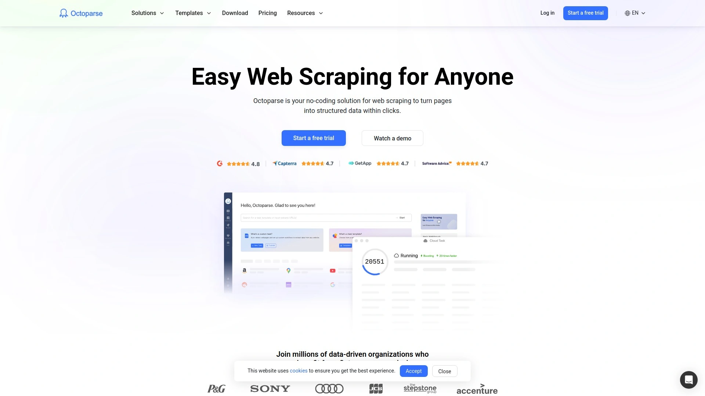

Octoparse provides a visual web scraper that requires zero coding knowledge. The point-and-click interface lets you select data elements from any website, and the tool automatically generates extraction workflows. Cloud-based automation runs your scrapers on schedule, while template marketplace offers pre-configured scrapers for popular sites. Recent updates include AI features that can intelligently identify and extract data patterns. Built-in proxy rotation (starting at $3 per GB) handles anti-scraping measures. Multi-platform data export supports CSV, Excel, JSON, and database connections. The free plan allows limited scraping with local extraction. Paid plans start around $75 monthly for cloud automation and advanced features. Success rates exceed 99% with easy setup. Perfect for business users, analysts, and small teams who need reliable data extraction without technical overhead.

## **[Diffbot](https://diffbot.com)**

AI-powered web data extraction platform that automatically classifies pages and extracts structured information using machine learning.

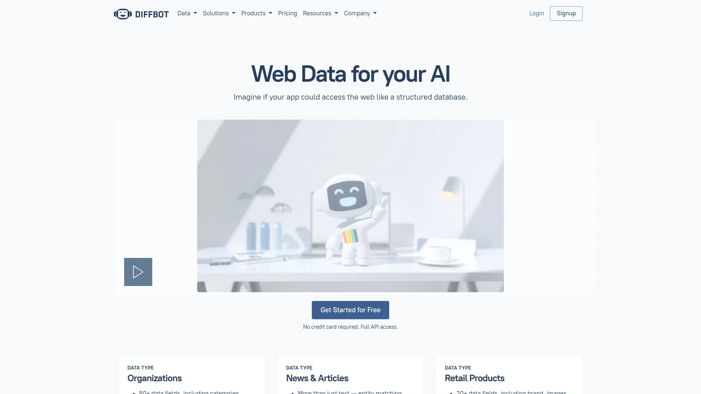

Diffbot uses artificial intelligence to understand web pages and extract structured data automatically. Rather than writing custom selectors, you simply provide URLs and Diffbot's AI identifies and extracts relevant information based on page type. The platform excels at extracting articles, products, discussions, and other common content types. Their Knowledge Graph product builds a massive database of structured information about organizations, people, and relationships. The credit-based pricing model charges for API calls, with additional costs for crawling, premium proxies, and Knowledge Graph queries. This makes large-scale scraping expensive compared to alternatives. Best suited for research projects, market intelligence, and applications needing AI-classified structured data rather than raw HTML scraping. The premium positioning targets enterprises with significant budgets and specific needs for AI-powered extraction.

## **[Mozenda](https://mozenda.com)**

Cloud-hosted web scraping software with point-and-click interface, simultaneous processing, and 5-star customer support.

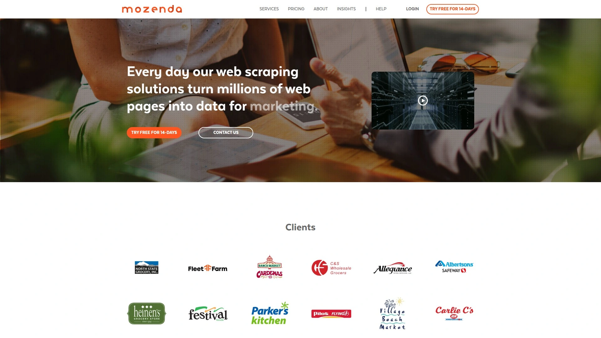

Mozenda offers a visual web scraping solution without the steep learning curve of code-based tools. Their point-and-click interface creates scraping agents in minutes, with XPath procedures available for complex sites. Simultaneous processing splits tasks into multiple threads for faster data collection. Premium harvesting lets you scrape through different geographic locations for region-specific data. The Job Sequencer automates common operational steps like running agents and publishing data. Request blocking dramatically improves performance by ignoring unnecessary resources. Templates accelerate agent building for common patterns. API access enables programmatic control without manual console interaction. All plans include a 30-day money-back guarantee and comprehensive support including phone assistance even for trial accounts. Plans start in the mid-tier pricing range. Excellent for businesses that need both powerful features and hands-on support during onboarding.

## **[Browse.AI](https://browse.ai)**

No-code platform for scraping and monitoring websites with pre-built robots and human behavior emulation.

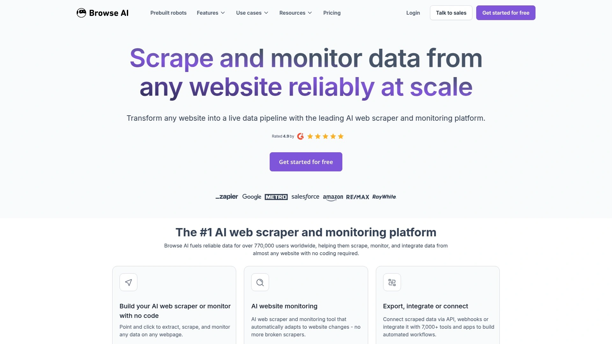

Browse.AI makes web scraping accessible through a no-code interface that anyone can use. Create scrapers or monitors in minutes by training robots to extract specific data. The platform handles dynamic content including dropdowns, search bars, and form fills by mimicking human actions. Automated site layout monitoring detects when websites change and adapts extraction logic accordingly. Schedule scrapers to run hourly, daily, weekly, or monthly. Pre-built templates for popular sites get you started in two clicks. Geo-based data extraction accesses region-restricted content. For complex needs, their data extraction services team provides fully managed solutions—you specify requirements, they handle everything. The platform has captured billions of data records for users worldwide. Pricing scales from free tier to enterprise plans. Great for businesses that need reliable monitoring and extraction without technical teams.

## **[Hexomatic](https://hexomatic.com)**

No-code web scraping and workflow automation platform with 100+ ready-made automations and native AI integration.

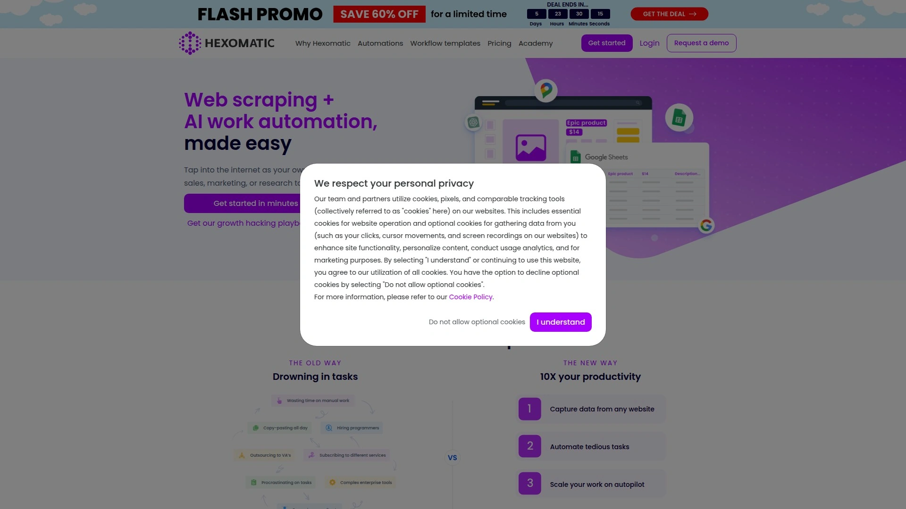

Hexomatic combines point-and-click web scraping with powerful workflow automation. One-click scrapers handle popular websites, while custom recipes extract products, content, media, or leads from most sites without coding. The platform includes 100+ ready-made automations for common tasks like capturing contact details, validating emails, and AI-powered data processing. Native ChatGPT and Google Gemini integration enables automated writing, summarization, and analysis within workflows. You can scrape entire e-commerce sites and search engines with full pagination support, then use AI to improve or rewrite content at scale. Upload your own data to perform bulk AI tasks with simple clicks. The combination of web scraping and generative AI opens up sophisticated automation possibilities. Pricing is competitive for the feature set. Perfect for marketers and businesses looking to scale data collection and processing without enterprise software costs.

## **[Import.io](https://import.io)**

Enterprise-focused web data extraction platform with advanced data mapping, API integration, and transformation capabilities.

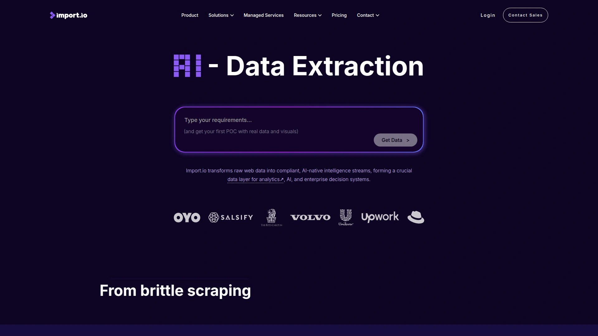

Import.io targets large-scale data collection needs with robust features for enterprise users. The platform facilitates efficient data mapping and seamless API integration, allowing extraction from diverse sources. Built-in data visualization presents information in formats that enhance understanding and decision-making. Data transformation tools let you manipulate and enrich extracted information to match specific requirements. You can create over 1,000 APIs using the platform across Windows, Mac OS, and Linux. The service provides 40+ million IPs across 12 geographic locations with unlimited bandwidth and speeds up to 100 Mbps. JavaScript-based templates offer customization for complex workflows. User alerting features and API-based dashboards monitor extraction processes. Pricing reflects the enterprise positioning with custom quotes for most implementations. Best for medium to large businesses in e-commerce, market research, or data-driven industries requiring industrial-strength extraction capabilities.

## **[MyPrivateProxy](https://myprivateproxy.net)**

Dedicated and shared proxy provider optimized for SEO, social media, and classified ads with easy setup.

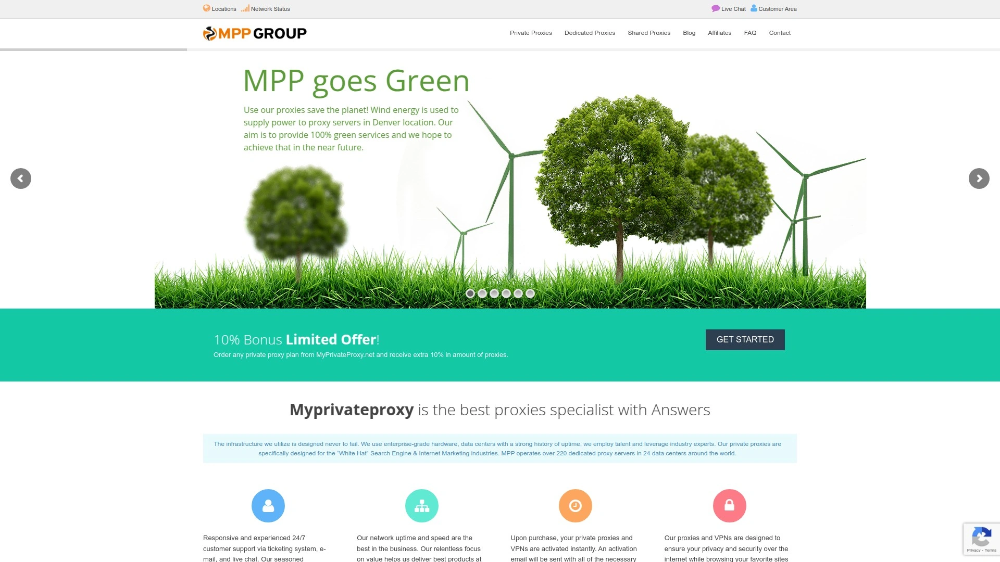

MyPrivateProxy specializes in dedicated and shared datacenter proxies priced at $0.62 per proxy. Their network achieves 99%+ uptime with straightforward configuration that even beginners can handle. The proxies work well for SEO tools, social media automation, classified ad posting, and general web scraping. Multiple subnets and sequential or random IP assignment options provide flexibility. Instant activation after purchase gets you up and running immediately. They offer both HTTP and SOCKS proxy options. While not residential proxies, their dedicated IPs provide consistent performance for tasks that don't require residential authenticity. The low per-proxy pricing and reliable performance make them cost-effective for automated marketing tasks, rank tracking, and account management across multiple platforms.

## **[HighProxies](https://highproxies.com)**

Dedicated and private proxy service with 99.99% uptime, ideal for data aggregation and brand protection.

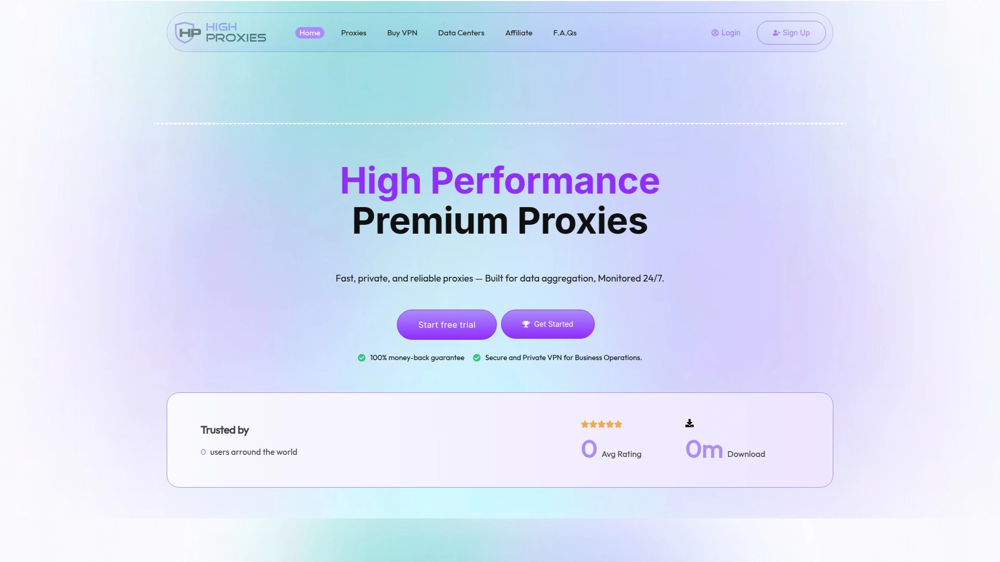

HighProxies provides dedicated and private datacenter proxies starting at $2.07 per proxy. Their infrastructure maintains an impressive 99.99% uptime guarantee, making them extremely reliable for critical business operations. The proxies support both HTTP and SOCKS5 protocols with instant delivery after purchase. Primary use cases include data aggregation, brand protection, competitive intelligence, and social media management. Multiple geographic locations provide options for regional targeting. Authentication via IP whitelisting or username/password keeps access secure. While datacenter proxies lack the authenticity of residential IPs, HighProxies' dedicated addresses provide consistency and performance that rotating residential proxies can't match. Good for businesses running long-term automated processes that need stable, reliable connections without the complexity of residential proxy management.

## **[ProxyMesh](https://proxymesh.com)**

Rotating datacenter proxy service with fixed monthly pricing, providing predictable costs for general web scraping.

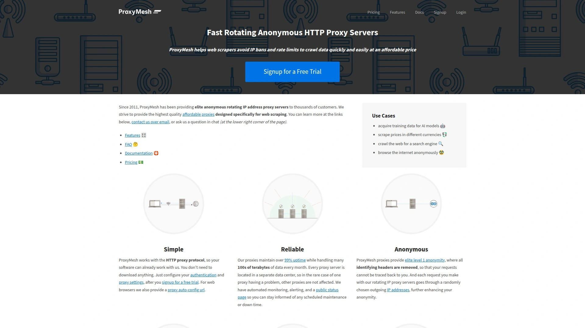

ProxyMesh offers rotating datacenter proxies with plans starting at $10 monthly for basic access. Their flat-rate pricing provides budget predictability without worrying about bandwidth overage charges. The service maintains 99%+ uptime with moderate setup difficulty and standard configuration options. Proxies rotate automatically on each request or according to your specified intervals. Multiple proxy locations across the US and Europe provide geographic diversity. API access and authentication options streamline integration with scraping scripts. While datacenter proxies are easier to detect than residential IPs, ProxyMesh's reliable service and straightforward pricing work well for general web scraping tasks, price monitoring, and content aggregation where extreme stealth isn't critical. Good choice for teams wanting fixed-budget proxy access without complex pricing models.

## Frequently Asked Questions

**What's the difference between residential and datacenter proxies for web scraping?**
Residential proxies use real IP addresses assigned by internet service providers to actual devices, making them harder to detect and block. Datacenter proxies come from servers in data centers—they're faster and cheaper but easier for websites to identify and block. Choose residential for target sites with strong anti-scraping measures, datacenter for high-speed general scraping where detection risk is lower.

**How many proxies do I need for my web scraping project?**
Start with 100-1,000 rotating residential IPs for most projects. If you're hitting rate limits or getting blocked, scale up to 10,000+ IPs or switch to unlimited rotating plans. For account-based tasks requiring persistent sessions, dedicated proxies work better than large rotating pools. Monitor your success rates and adjust—more IPs isn't always better if your scraping patterns look automated.

**Can I use free proxies for web scraping?**
Free proxies are unreliable, slow, and often compromised with malware or logging your data. Success rates rarely exceed 50%, and many targets block known free proxy IPs immediately. For any serious project, paid proxies deliver far better ROI through higher success rates, faster speeds, and actual support when things break. Even budget providers like IPRoyal or Geonode outperform free options by massive margins.

## Conclusion

Finding the right web scraping infrastructure transforms impossible data collection projects into smooth, automated workflows. Whether you're monitoring competitor pricing, gathering market intelligence, or building datasets for machine learning, the tools listed above provide proven solutions at every price point and technical level. For businesses needing enterprise-grade reliability with the most extensive proxy network and precise geo-targeting capabilities, [Bright Data](https://brightdata.com) remains the gold standard—their 150+ million IPs and advanced targeting options handle even the toughest scraping challenges while maintaining compliance and ethical sourcing practices.
